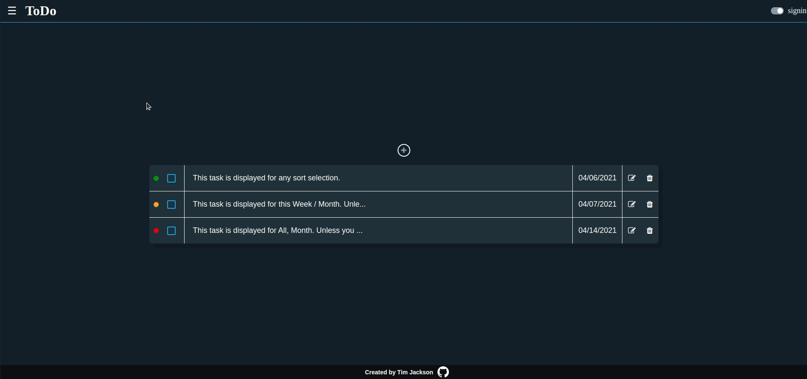

<h1 align="center">
   
  ToDo-List
   
  <image src="dist/images/logoImage.png" width="50%"> 
</h1>

<h4 align="center">ToDo-List an app to keep track of projects and their task. I used JavaScript, HTML, and CSS for this project.</h4>

  <a href="#screenshots">Screenshots</a> •
  <a href="#goals">Goals</a> •
  <a href="#summary">Summary</a> •
  <a href="#author">Author</a> •
    <a href="#credits">Credits</a> •
  <a href="#license">License</a>

### ✨ [Live Preview](https://timjacksonm.github.io/ToDo-List)
## Screenshots

  
Show Image

  

The next two images showcase responsive web design for IphoneX & Ipad.
  <image src="dist/images/RWDIphoneModify.png">
  <image src="dist/images/RWDIphoneDescription.png">
    <image src="dist/images/RWDIpad.png">

## Goals:
- [✔️] Create the code that generates your ToDos using factories or constructors/classes.
- [✔️] Implement all the properties your ToDos are going to have. e.g. title, description, due date, priority, notes, check list.
- [✔️] ToDo list should have projects or separate list of todos. Create option where the user can create a new Project and choose to assign ToDo's to it or another project.
- [✔️] Separate your application logic into separate modules/js files.
- [✔️] User interface should be able to 1.) view all projects 2.) view all todos in each project 3.) expand a single todo to see/edit details 4.) delete todo.
- [✔️] Use local storage to save user's projects and todos between sessions.

**Optional Extra Credit**
- [✔️] Implement a light and dark mode.
- [✔️] Add library code date-fns to project.

**View Commits on project to see changes**

## Summary

I found this project very rewarding. From using webpack librarys like date-fns, separating my apps logic into different es6 modules and also manipulating my array data inside of local storage. I learned a lot!  Most challenging for me was figuring out all the different ways you could 'break' this app and implementing fixes. You can add / modify / delete any task or projects. Everything is saved in memory so if you leave the page and come back what you changed/added should still be present. I did get around to adding a light/dark mode to one of my projects finally, it works well - I had used css variables to change the theme. I created multiple default task to showcase the different things you can do with my ToDo-List. Feel free to try it out! If you need to revert the ToDo-List back to the default setup. Go into console and type localStorage.clear().

## Author

👤 **Tim Jackson**

- Github: [@timjacksonm](https://github.com/timjacksonm)
- Twitter [@timjacksonm](https://twitter.com/timjacksonm)
- LinkedIn [@timjacksonm](https://linkedin.com/in/timjacksonm)

## Credits

This project idea was a part of my studies at The Odin Project's curriculum. You can see the lesson <a href="https://www.theodinproject.com/paths/full-stack-javascript/courses/javascript/lessons/todo-list" target="_blank">here</a>!

## License

  <a href="https://choosealicense.com/licenses/mit/">
    

